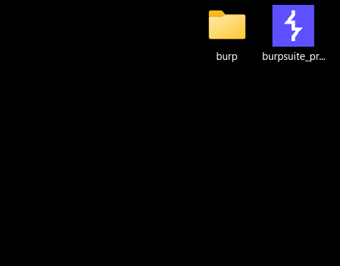
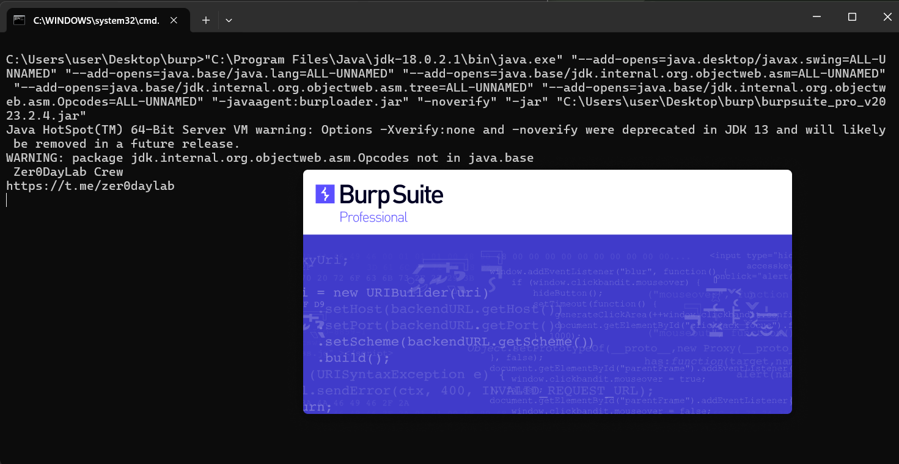
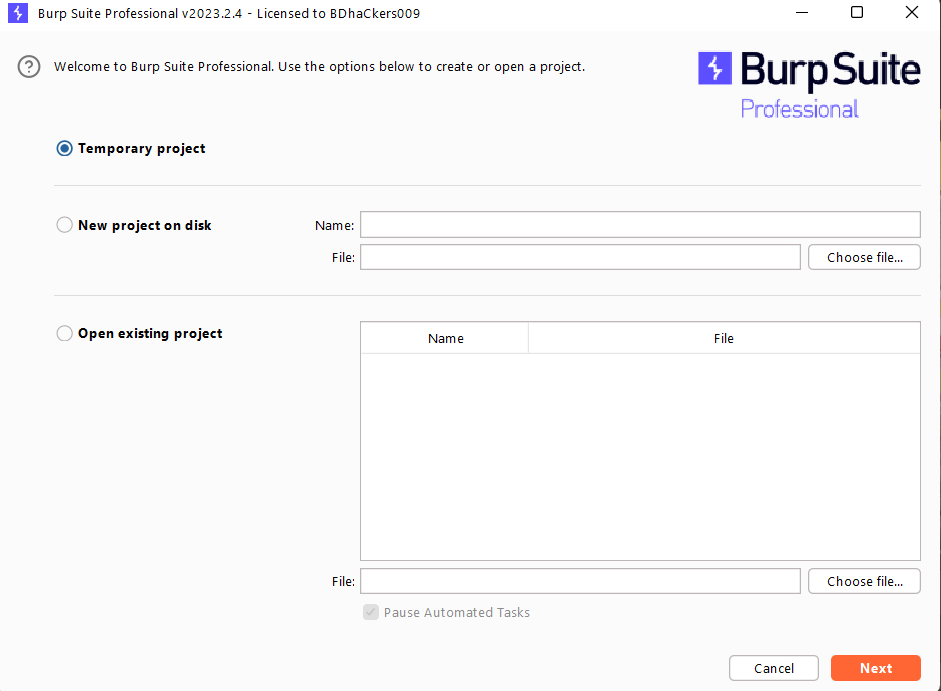
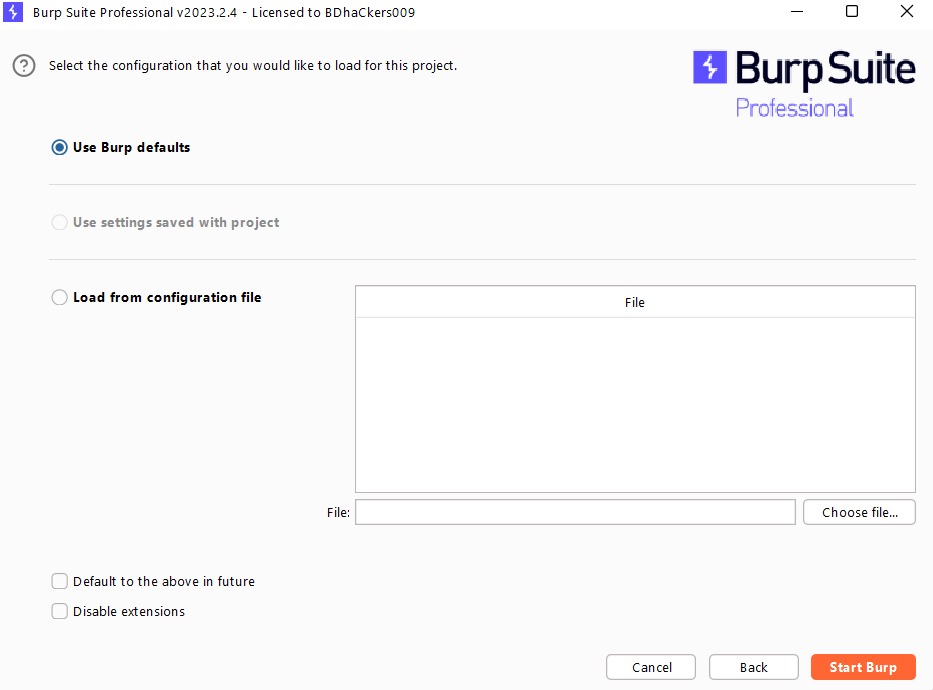
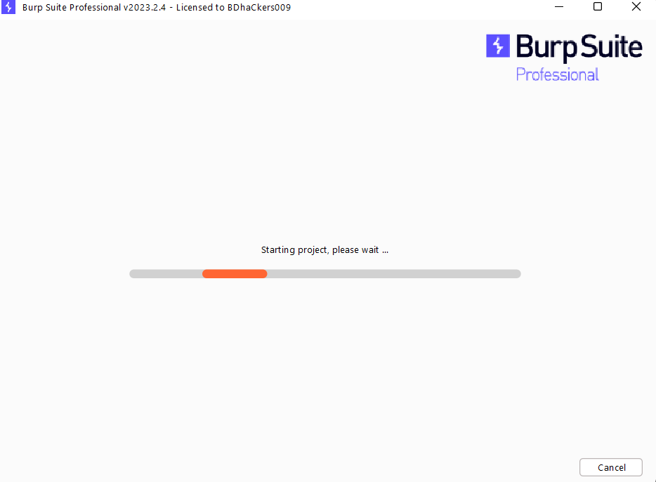
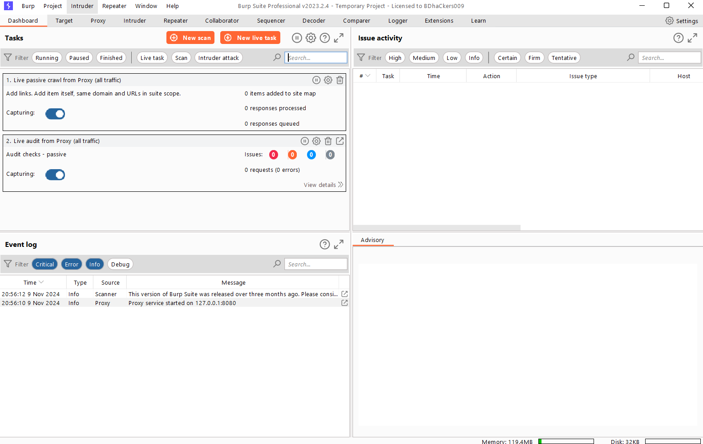

# BurpSuite Loader

This project provides an easy setup for launching BurpSuite Pro using `burploader.jar`. Follow the instructions below to get started and troubleshoot any issues.

> **Note:** This project is not my main focus. I am sharing it because I enjoy helping others, and it’s my passion to make things easier for people. 

<table>
  <tr>
    <td></td>
    <td></td>
    <td></td>
  </tr>
  <tr>
    <td></td>
    <td></td>
    <td></td>
  </tr>
</table>

## Download

You can download BurpSuite files from the following link:
[Download BurpSuite](https://ihefty.github.io/BurpSuite-Loader/)

## Requirements

- Java Development Kit (JDK) version 18.0.2.1
- BurpSuite Pro version 2023.2.4

## Installation

1. Download and extract the BurpSuite files from the link above.
2. Ensure the JDK is installed and the Java path is set to:
   ```
   C:\Program Files\Java\jdk-18.0.2.1\bin\java.exe
   ```

## Running BurpSuite with Loader

1. **Using Command Line**  
   To start BurpSuite with `burploader.jar`, open a terminal or command prompt and run:
   ```bash
   java -jar burploader.jar
   ```

2. **Using `burp.bat` Script**  
   Alternatively, you can use the provided `burp.bat` file for launching BurpSuite:
   ```batch
   "C:\Program Files\Java\jdk-18.0.2.1\bin\java.exe" "--add-opens=java.desktop/javax.swing=ALL-UNNAMED" "--add-opens=java.base/java.lang=ALL-UNNAMED" "--add-opens=java.base/jdk.internal.org.objectweb.asm=ALL-UNNAMED" "--add-opens=java.base/jdk.internal.org.objectweb.asm.tree=ALL-UNNAMED" "--add-opens=java.base/jdk.internal.org.objectweb.asm.Opcodes=ALL-UNNAMED" "-javaagent:burploader.jar" "-noverify" "-jar" "C:\Users\user\Desktop\burp\burpsuite_pro_v2023.2.4.jar"
   ```

   Modify the last part of the path in `burp.bat` if your BurpSuite file is in a different location.

## Troubleshooting

If you encounter issues when launching BurpSuite, follow these steps:

1. **Clear BurpSuite Cache**  
   Open Command Prompt and enter the following commands to clear BurpSuite's cached files:
   ```cmd
   rd /s /q "%userprofile%\AppData\Roaming\BurpSuite\"
   ```

2. **Delete Java Preferences**  
   Remove any existing Java preferences for BurpSuite by running:
   ```cmd
   reg delete "HKEY_CURRENT_USER\SOFTWARE\JavaSoft\Prefs\burp" /f
   ```

   After clearing the cache and preferences, try running BurpSuite again.

## File Paths

- **JDK Path:** Ensure that your JDK is installed at `C:\Program Files\Java\jdk-18.0.2.1\bin\java.exe`.
- **BurpSuite Path:** Ensure `burpsuite_pro_v2023.2.4.jar` is correctly located at `C:\Users\user\Desktop\burp\`.

